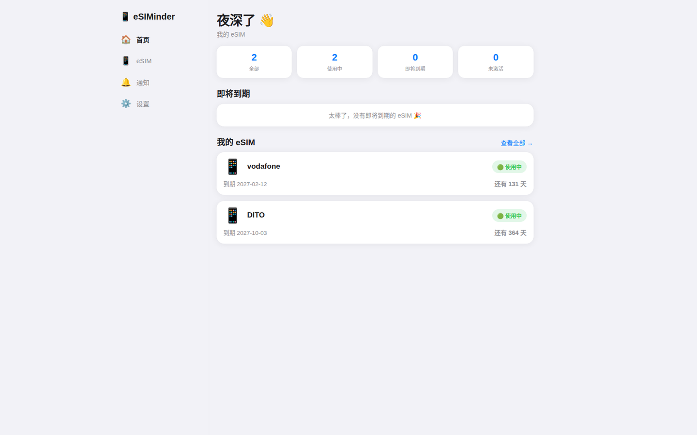
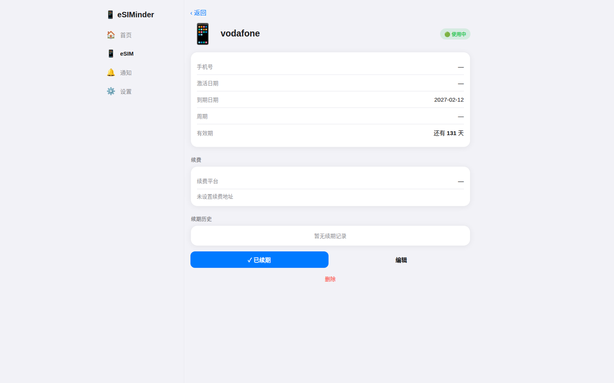
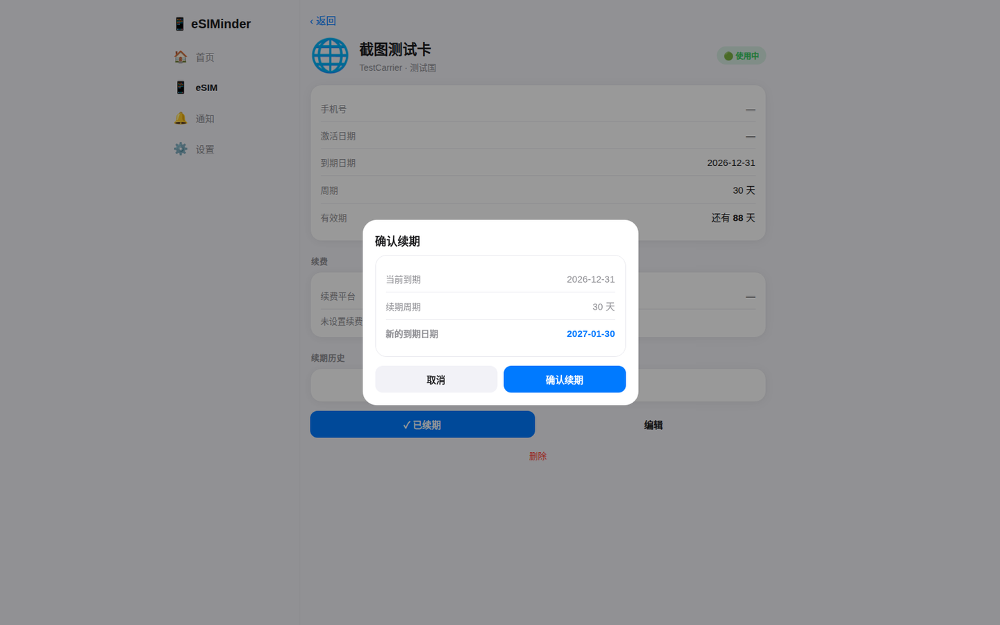
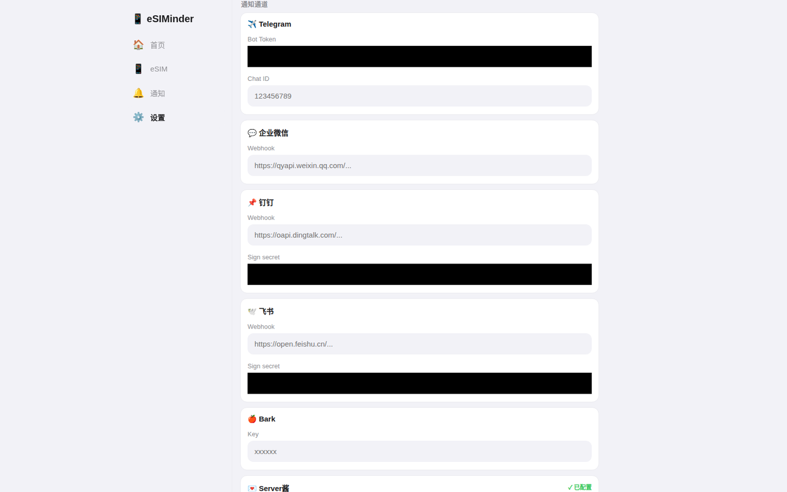
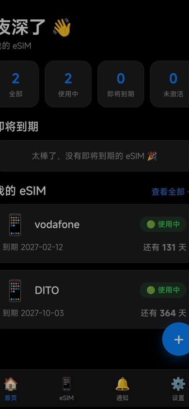

<p align="center">
  <a href="./README.md">🇨🇳 中文</a>
  ·
  <a href="./README.en.md">🇬🇧 English</a>
</p>

<h1 align="center">eSIMinder 🔔</h1>

<p align="center">
  <strong>个人 eSIM 生命周期管理工具</strong><br>
  集中管理 eSIM · 到期自动提醒 · 一键续期 · 多渠道通知
</p>

<p align="center">
  <a href="https://deploy.workers.cloudflare.com/?url=https://github.com/Newbee06/esiminder"></a>
</p>

<p align="center">
  <a href="https://x.com/BTC108_">𝕏 @BTC108_</a>
</p>

---

> 不再因为忘记续费，让一张 eSIM 在旅行途中突然失效。

## ✨ 核心功能

### 📱 eSIM 管理

统一管理名称、国家/地区、运营商、手机号、激活日期、到期日期、续费周期和续费链接。支持标签、搜索、状态筛选，状态由系统自动计算。

### 🔔 到期提醒

支持 7 / 3 / 1 / 0 天提醒，可自定义提醒周期。7 个通知渠道：Telegram、微信（企业微信）、钉钉、飞书、Bark、Server酱、邮件（Resend）。

### 🔄 一键续期

自动计算新的到期日期，支持过期卡续期、续期预览、续期历史和 `requestId` 幂等。

### ☁️ Cloudflare 部署

基于 Cloudflare Workers + D1 + KV，无需自建服务器，可部署到用户自己的 Cloudflare 账户。

> **设计定位**
>
> eSIMinder 专注个人 eSIM 生命周期管理，不包含用户注册、多用户、支付及财务管理等复杂业务。

## 🖥️ 界面预览

### Dashboard

<p align="center">
  
</p>

### eSIM 详情

<p align="center">
  
</p>

### 一键续期

<p align="center">
  
</p>

### 通知中心

<p align="center">
  
</p>

### 移动端

<!-- Screenshot: docs/screenshots/mobile.png
     推荐 390×844。展示：手机底部 Tab Bar / Dashboard / eSIM 卡片 / 到期状态。
     截图就绪后替换为：
     <p align="center">
       
     </p> -->

## 👤 适合谁

- 经常使用海外 eSIM 的旅行者
- 同时管理多张 eSIM 的用户
- 需要长期记录套餐到期时间的用户
- 不想因为忘记续费导致 eSIM 失效的用户

## 🎨 界面

iOS 风格设计，浅色 / 深色 / 跟随系统；手机底部 Tab Bar，电脑左侧 Sidebar；中英双语。

## 🚀 部署

### A. 一键部署

[](https://deploy.workers.cloudflare.com/?url=https://github.com/Newbee06/esiminder)

1. 点击 **Deploy to Cloudflare**，登录并选择自己的 Cloudflare Account
2. 设置 `ADMIN_TOKEN`（后台登录密码）
3. Cloudflare 自动为该部署创建 D1 / KV，完成 Worker 部署
4. 打开 Worker URL，用 `ADMIN_TOKEN` 登录，首次登录后修改密码

> 每次部署使用部署者自己账号中的 D1 / KV，不使用仓库作者的资源。`ADMIN_TOKEN` 不提交到 GitHub。

### B. 手动部署

```bash
npm install
npx wrangler kv namespace create CFG   # 可选：deploy 时可自动供应
npx wrangler d1 create esiminder-db    # 可选：deploy 时可自动供应
npx wrangler secret put ADMIN_TOKEN
npx wrangler deploy
```

> 如 CLI 返回资源 ID，只写入本地 `wrangler.toml`，不要提交到公开仓库。

## 🆕 V2.1 更新

| 功能 | 说明 |
|---|---|
| 续费幂等 | `requestId` 防止重复续费 |
| 原子续期 | D1 单事务，要么全部成功要么全部回滚 |
| 通知去重 | 去重状态进 D1，失败自动重试 |
| 日期校验 | 拒绝非法日期 |
| 配置校验 | 提醒天数标准化、时区服务端校验 |
| 通知超时 | 全部渠道 10 秒超时 |

## 🏗️ 技术架构

Cloudflare Workers + D1 + KV，无其他依赖。

- 数据库表首次请求自动创建，无需手动执行 SQL
- V1 → V2、V2.0 → V2.1 迁移自动执行（幂等）
- Cron `0 1 * * *`，每天北京时间 09:00 检查到期并推送提醒

## 🗄️ 数据结构

```
D1
├── esims
├── renewal_records
├── notifications
├── settings
├── notification_dedup
└── renew_idempotency

KV
├── channels
├── admin_token
├── sess:*
├── login:rl:*
└── migration markers
```

## 📡 API

| Method | Endpoint | 说明 |
|---|---|---|
| POST | `/api/login` | 登录 |
| GET / POST | `/api/esims` | 列表 / 新建 |
| GET / PUT / DELETE | `/api/esims/:id` | 详情 / 更新 / 删除 |
| POST | `/api/esims/:id/renew` | 续期（`requestId` 幂等） |
| GET | `/api/dashboard` | 首页数据 |
| GET | `/api/notifications` | 通知记录 |
| GET / PUT | `/api/settings` | 设置 |

## 🧪 测试

```bash
npm test
```

覆盖：Renewal Idempotency、Concurrent Renewal、Notification Deduplication、Notification Retry、Date Validation、Configuration Validation、Cron、Migration、Deployment Configuration。

## ⚠️ 已知问题

- Cron 固定北京时间 09:00；时区设置只影响「今天」的日期边界计算
- 邮件通道依赖 Resend，发件域名需在 Resend 验证
- 通知历史不自动清理（个人用量可忽略）

## 🤝 Author

Created by [𝕏 @BTC108_](https://x.com/BTC108_)

## License

MIT
